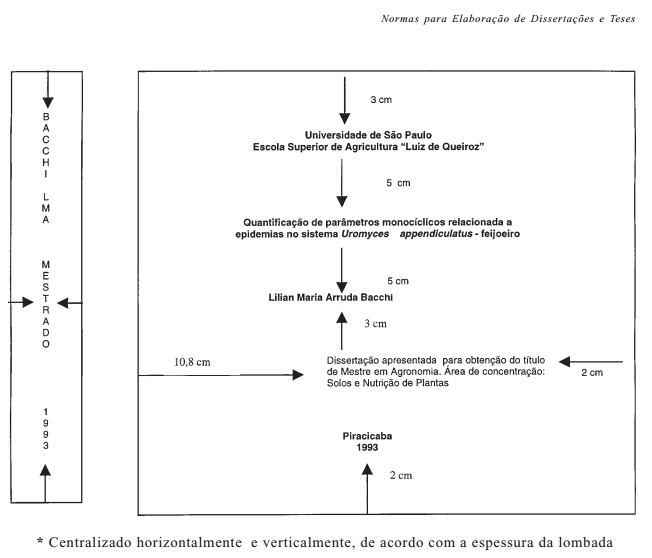

--- 
title       : Templates para Teses e Dissertações
subtitle    : Uma proposta
author      : A. Augusto F. Garcia, Luis Eduardo A. Camargo, Lázaro E. P. Peres, Severino M. Alencar
job         : ESALQ/USP
framework   : io2012        # {io2012, html5slides, shower, dzslides, ...}
highlighter : prettify  # {highlight.js, prettify, highlight}
hitheme     : solarized_light    # era tomorrow
linenums    : true
widgets     : [mathjax, bootstrap, quiz]   # {mathjax, quiz, bootstrap}
mode        : selfcontained # {standalone, draft}
--- 

## Introdução

- Objetivo: eficiência e produtividade
- Usar os modernos recursos computacionais
- Flexibilidade de procedimentos
  - Importação de formatos
  - Foco no conteúdo, não nos formatos e regras

---

## Formato Atual

- "Windows-cêntrico"
- Normas que devem ser implementadas no computador
  - Nem sempre isso é possível, exigindo muitas intervenções
  - Rígido, não adaptado aos diferentes cenários

---

## Exemplos (cm? No computador?)

---

---

## Citações

- Basicamente, formato da ABNT
  - Cidade da revista
  - Identificação de contexto (intervenção humana!): número de
  autores, parênteses ou não, etc
  - $\ldots$

---

## Times New Roman

- A Times New Roman é uma família tipográfica serifada criada em 1931
- Jornal inglês *The Times of London*
- Uma versão da Times New Roman foi produzida pela Monotype para a
Microsoft
- Distribuída em todas as cópias do Microsoft Windows desde a versão
3.1.
- A Microsoft procura substituir a Times New Roman com uma nova fonte
sem serifa, a *Calibri*
  - (Fonte: [Wikipedia](http://pt.wikipedia.org/wiki/Times_New_Roman))

---

## Qual é o problema?

- Assume-se (e, num certo sentido, recomenda-se) o uso do *MS Word* (MS
Office)
- Mundo contemporâneo:
  - Windows
  - Mac
  - Linux
  - $\ldots$

---

## Preciosismo? Excentricidade?

- Computação em nuvem (Google Docs, ...)
- LibreOffice
- LaTeX
- (html5, $\ldots$)

---

## Exemplos

### Theoretical and Applied Genetics

---

## Fórmulas

---

## LaTeX (e outros formatos)

- Muitas revistas e livros usam o formato
- Biometrics, Genetics, *PLOS ONE*, $\ldots$
- Há na ESALQ um "*Guia de Sobrevivência para Usuários do LaTeX*"

--- bg:#fee6ce

# Proposta

## Apresentar um "template" real e efetivo (não um documento modelo)

- Redação de Dissertações e Teses usando diferentes programas e
sistemas operacionais, de acordo com as necessidades do usuário
- Não elimina ou privilegia algum programa
- Porém, obviamente, leva em consideração que a maioria dos usuários
usa o *MS Word*
- Permite tanto formatação automática quanto manual
  - Usuários podem optar por não usá-lo!
- Pode ser atualizado constantemente, levando em conta sugestões dos
usuários (em última análise, quem procuramos atender)
- Elaboração de Tutoriais

---

## Mudanças

- O computador faz o serviço para nós (e não o contrário)
- Ao delegar, precisamos ter certa flexibilidade com os resultados que
esperamos receber
  - Exemplos: margens exatas, letras com tamanho exato, "kerning", etc
  - Faz diferença usar *Figura 1.*, Figura 1., Figura 1 -, Figura 1:,
  etc?
  - O "índice" precisa ter medidas precisas, ou basta mostrar onde
  estão as informações que procuramos?
  - Todas as teses precisam ter a mesma fonte? (E para as equações, a
    fonte usada deve estar na norma? Isso vale para letras gregas
    também?)
- Vantagem: foco no que é importante (conteúdo), aumento de
produtividade
- Na prática, as diferenças são mínimas e imperceptíveis a olho nu
(ex: 7,5 cm ou 7,7 cm)

---

## Muitas Possibilidades

- Converter relatórios em teses (quanto ao formato)
- Converter artigo em tese, e vice-versa
- Conversão entre os formatos das diferentes revistas de forma simples
- $\ldots$

---

## O que é necessário?

- Situação Ideal:
  1. Base de dados com referências bibliográficas
  2. Entendimento sobre o uso dos templates

- Para o primeiro item: organização dos alunos durante todo o curso

  - Porém, caso isso não seja adotado, o sistema atual (digitação e
  conferência de todas as referências) ainda é possível

- Segundo item: Tutoriais, motivação do orientador, divulgação

  - Podem obviamente incorporar também o item 1

---

## Formatos para citação adotados pelas principais revistas

- [Citation Styles, CSL, http://citationstyles.org](http://citationstyles.org/)
  - Mais de 6700 estilos de citação abertos e gratuitos
  - As principais revistas participam e contribuem
  - Tais formatos podem ser importados em vários programas
  gerenciadores de referências

---

## Gerenciadores de Referências

  1. [Mendeley](http://www.mendeley.com/)
  2. [Zotero](https://www.zotero.org/)
  3. [EndNote](http://endnote.com/) (Permite exportar? CSL?)
  4. [BibTeX](http://www.bibtex.org/)
  5. $\ldots$ (a lista é longa!)

--- bg:#fee6ce

# Demonstração

## Template + Word + Mendeley

1. Formatação: de artigo para tese
2. Inserir referências
3. Mudar o formato das citações

--- bg:#fee6ce

<q>OBRIGADO!</q>
